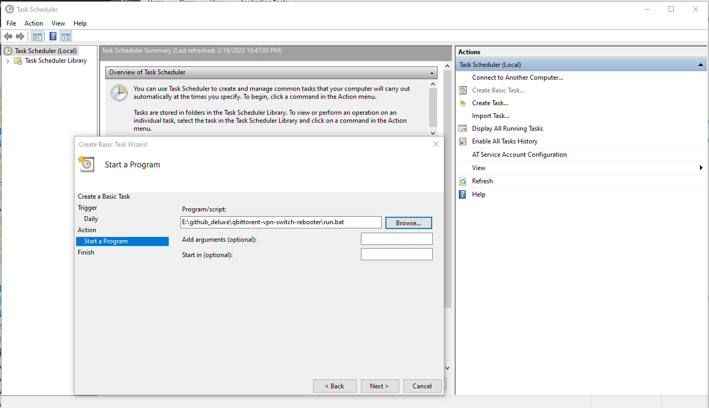
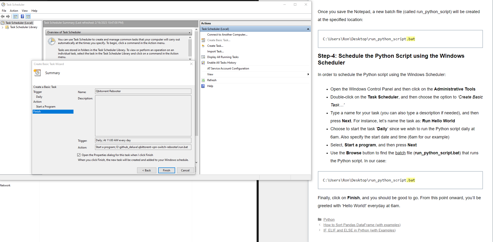
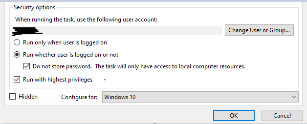

## Changes Vs Original

Script now waits for sucessful shut down before relaunching qBittorent

# qbittorent-vpn-switch-safebooter

This script detects whether the running qBittorent instance (using the webUi plugin over localhost) needs to be rebooted due to no torrents actually downloading. This frequently happens after the VPN changes IP addresses and qBittorent fails to update.

## Install
1. Add a shorcut to qbittorent to this folder and rename it to "qtshortcut".
2. Change the links in `run.bat` to point to where you installed this repo.
3. Run `pip install qbittorrent-api`
4. Run `python main` whenever. Use the Windows Scheduler Service.
   
## Windows Scheduler Service

Use this to automate running this rebooter task whenever you like.

Tip* add folder location of `run.bat` to `start in` in task scheduler

- https://pureinfotech.com/prevent-command-window-appearing-scheduled-tasks-windows-10/
- your mileage may vary (this didnt work for me, task stuck in running and or qbittorrent will be web only mode and missing from system tray.)
- trying to lauch via shortcut will launch an new instance of qbittorrent how well they sync im not sure
  

Changelog
v1.0 - 4/27/25
   - added shutdown and boot monitioring
   - added seeding to good torrent list 
   
